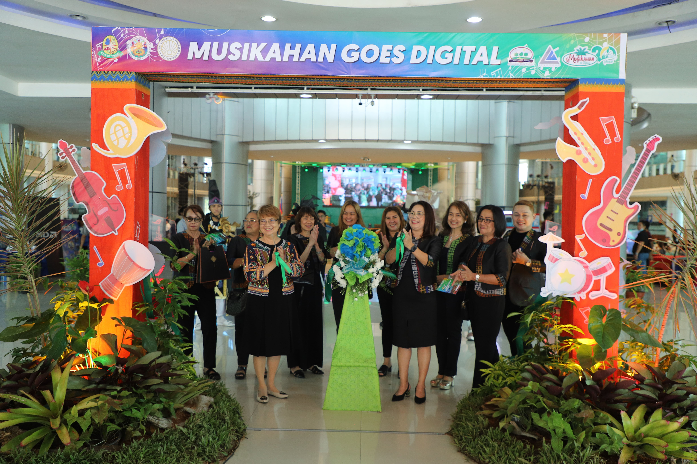
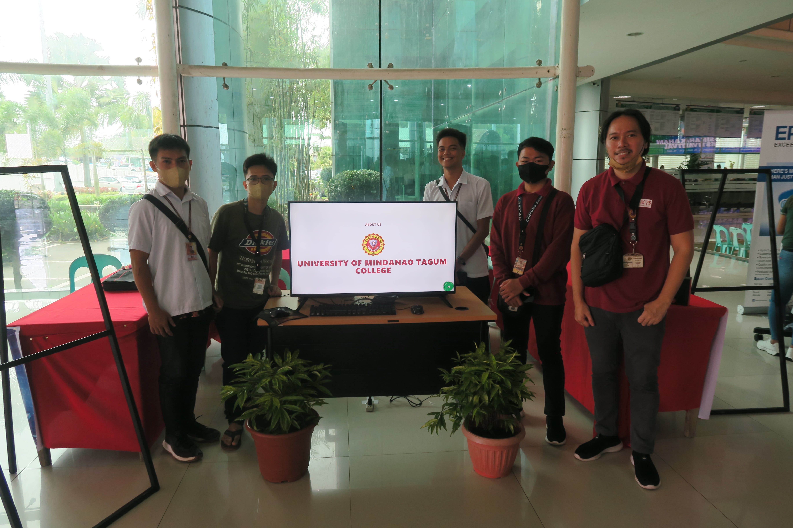
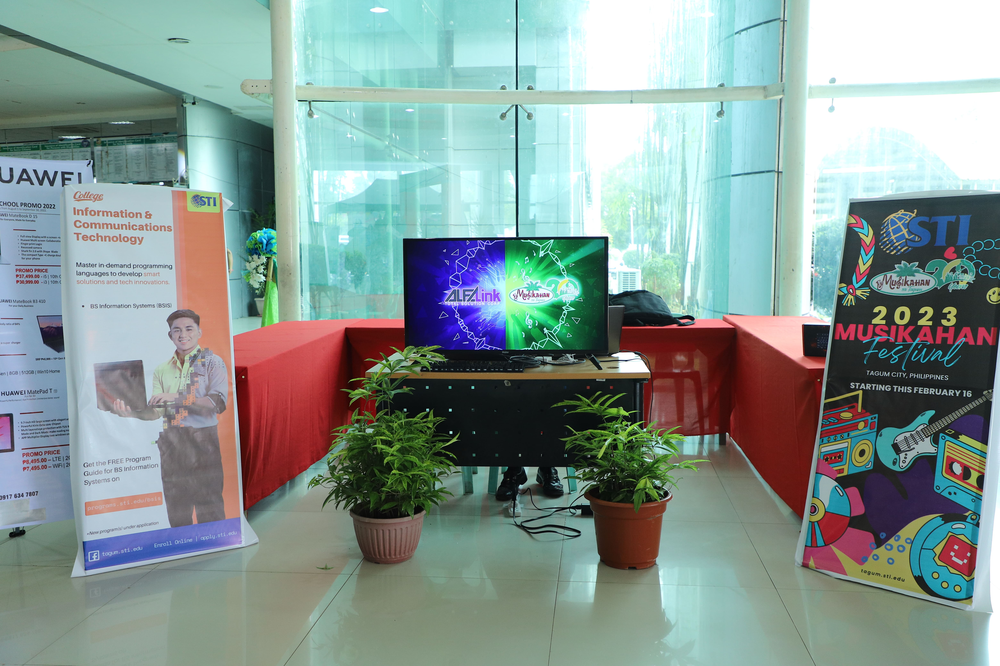
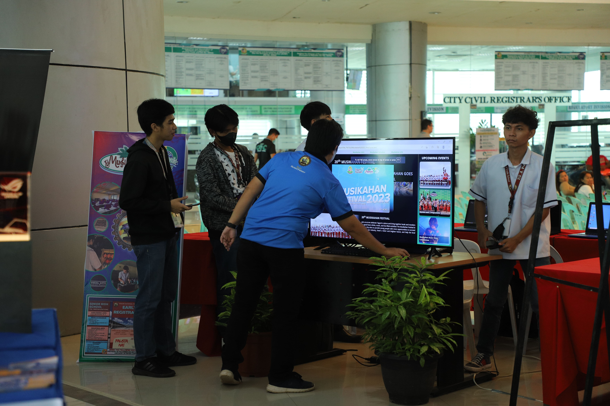
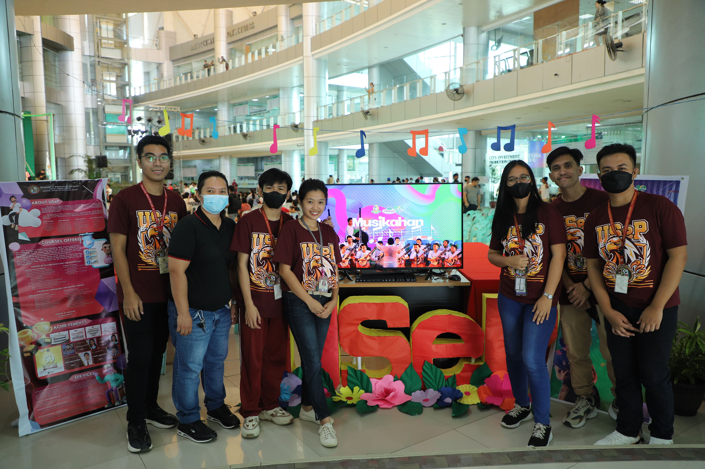

# 𝐇𝐀𝐏𝐏𝐄𝐍𝐈𝐍𝐆 𝐍𝐎𝐖: 𝐓𝐇𝐄 𝐈𝐂𝐓 𝐁𝐀𝐒𝐄𝐃 𝐌𝐔𝐒𝐈𝐊𝐀𝐇𝐀𝐍 𝐄𝐕𝐄𝐍𝐓 𝐃𝐔𝐁𝐁𝐄𝐃 𝐀𝐒 𝐌𝐔𝐒𝐈𝐊𝐀𝐇𝐀𝐍 𝐆𝐎𝐄𝐒 𝐃𝐈𝐆𝐈𝐓𝐀𝐋 𝐎𝐅𝐅𝐈𝐂𝐈𝐀𝐋𝐋𝐘 𝐋𝐀𝐔𝐍𝐂𝐇𝐄𝐃 𝐓𝐎𝐃𝐀𝐘!

The grandest music festival embraces technology in this year’s celebration. Musikahan sa Tagum festival in its 20th year will connect Tagumenyos via online making it accessible even far away from home specifically those who are unable to personally celebrates the power of music.

|                                                |                                                |
| :--------------------------------------------: | :--------------------------------------------: |
|  |  |
|  |  |

Prominent ICT schools in Tagum; such as the STI, Tagum National Trade School, University of Southeastern Philippines – Tagum Mabini Campus and UM Tagum are the teams committed to engage in Musikahan Goes Digital and will work on its creation. These institution were tasked to develop a webpage with content information on different Musikahan Competition, where event, date, time and venue are visible in the page, to include the recognition of winners.

This platform will be used as a digital briefer for all the event that will take place in the city, along with a digital score board where people can easily track the scores and unified results of the winners. This also evaluate audience survey of performance.

To be more updated for the 20th Musikahan sa Tagum, you can access the webpage of different schools through these links:

https://tagumcity.gov.ph/musikahan
https://tagumcity.gov.ph/musikahan/umtagum
https://tagumcity.gov.ph/musikahan/usep
https://tagumcity.gov.ph/musikahan/sti
https://tagumcity.gov.ph/musikahan/tnts

#Musikahan2023
#20thMusikahanFestival
#WeCreateOpportunities
#WeAreTagum
